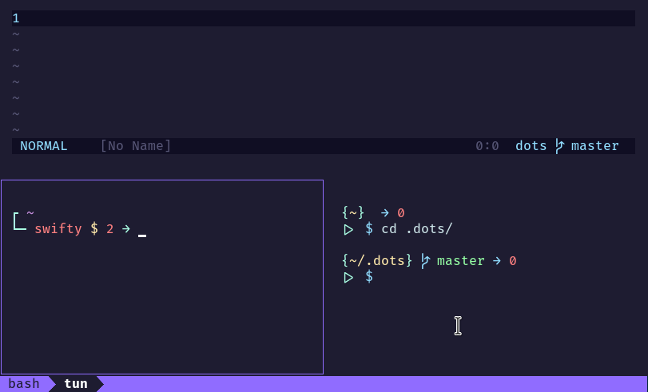

# dots

My personal config files with some magic to setup fresh macos/linux installs.



**Nota:** *This is a forever WIP of my environment, please read the source code before run this.*

## Installing

Get the source and cd into the directory:
```
git clone git@github.com:tun/dots.git .dots && cd .dots
```

_The setup script detects whether is running on macos or linux_.

#### Install dot files:
```
./setup --dots
```

#### Install development environment:
```
./setup --dev 
```

#### Install packages:
```
./setup --packages 
```
### Usage
```
./setup.sh [--packages | --dots | --dev | --all | --help]
```
